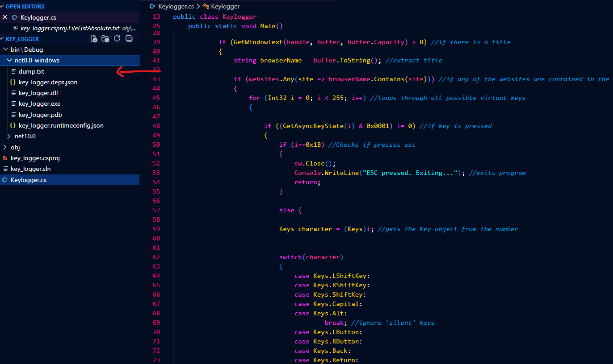

# List of Projects

## Keylogger
Basic keylogger which runs on a .NET platform so please make sure to initialize that first. For now it is manually run project which requires you to run the original folder and access either Facebook, Instagram or Gmail and it should log all keyboard inputs into a file called dump.txt. An example has been shown below how your file structure should look as well as where the output file is:

