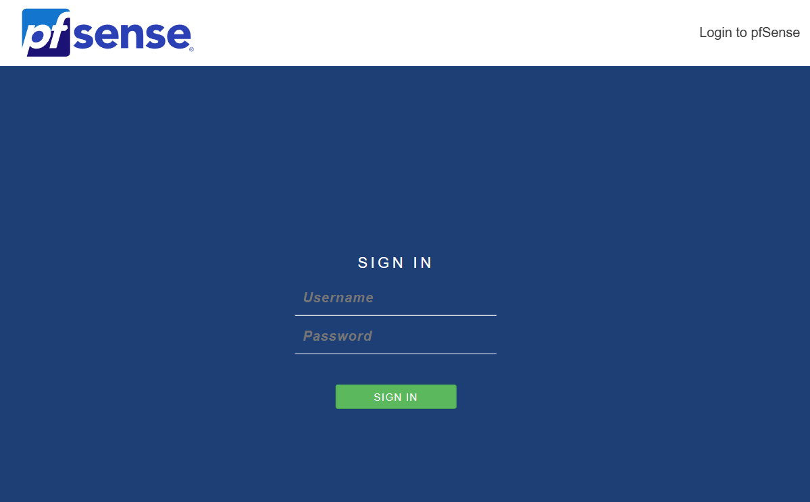

# Part 2 - Setting Up Network Firewall

At this stage I have had my two vms from earlier, a Kali Linux and the Ubuntu, in order to customize my setup for this lab:
* I went ahead and uninstalled Safeline on my Ubuntu using the same link that I installed it with
* I also set up a new custom virtual network to keep both my Ubuntu and Firewall on, let's call it "vmnet1"
* I also set up the Ubuntu to only be on the LAN network so it cannot be accessed throught the internet
* I set a new pfsense firewall vm on vmware, this required that I configured two network adapters one with WAN (em0) and one with vmnet1(em1), they connect to the internet and internal network respectively. I don't feel like I need to explain this one since it's simply downloading and deploying with the ISO file


## Setting Up Pfsense firewall
In order to access from the home machine I needed to disable the firewall temporarily, you can do this by entering the shell by entering "8" then type

```
pfctl -d #which disables the packet filter control
```
then write the WAN address into your host device (the one outside the VM) and you should be met with the Pfsense browser gui.



Default username: admin

Default password: pfsense

You should be able to complete the setup everything is kept default except two rules.
1. Disable "Block private network from entering via WAN"
2. Disable "Block non-Internet routed networks from entering via WAN"

If your devices crashes and your host network can no longer make requests just do a reboot of the server.

## Setting Up Firewall Rules
To set up a basic firewall rule you need to access the browser GUI, 

1. Go to Firewall > Rules > WAN > Add and set the source of the rule to our network source
2. The network source is usually 192.168.0.0/24
3. Set the destination to your Pfsense's WAN address
4. If you can access Interfaces > WAN over your browser GUI it works

## Setting up DHCP over Pfsense
To set up DHCP, simply go into Services > DHCP Server > LAN
1. Enable DHCP Server on LAN interface
2. type "ipconfig" into your host machine to get the IP address of your router it would usually go under "Default Gateway" or "DNS Server" since they share the same device
3. Go into "Server Options" in the web GUI and paste the IP address in "DNS Servers"

You should now be able to ping an outer service say 8.8.8.8 from your Ubuntu now that they're wired up to the same network. 

4. Install Wireshark with
```
sudo apt install wireshark
```


## Troubleshooting Connection
If your Ubuntu device messes up like me and doesn't ping 8.8.8.8 please check the following things
* Is both Pfsense LAN and Ubuntu connected to the same vmnet?
* Is Pfsense WAN and LAN connected to the same subnet, if yes please change one of them to a different subnet. This makes it hard for the machine to differentiate what side is mean't to be the outer side and what side should be the inner side
* Type "ip route" in Ubuntu kernel, if there isn't a line like "default via ..." then write "sudo ip route add default via ( add IP address of your LAN)"
* Restart your Pfsense

It should work now, if all else fails reinstall a new VM and repeat, sometimes remnance of past projects mess up the networking

# Setting Up Kali Linux
Now we go onto setting up Kali Linux, if you try to ping the Pfsense WAN from Kali you notice it, doesnt work. 

To fix this we add a custom rule to the Pfsense firewall just like we did before except allowing ICMP packets to be sent from our Kali. Remember to press 'apply changes'.

Now for the fun part we will simulate a "syn flood attack". In your command terminal type

```
sudo hping3 -S -p 80 --flood <insert ubuntu's address here>
```

This will essentially send a hping SYN (-S) to port 80 (an untrusted port) and flood it

# Setting Up Firewall to block it
Now in order to block the SYN Flood you can register a new rule on the firewall to reject all packets from your Kali Linux ip. If you retry the flood attack again you will see less packets go through at that your firewall has logged activity of the flood.

Now you've successfully blocked a SYN Flood