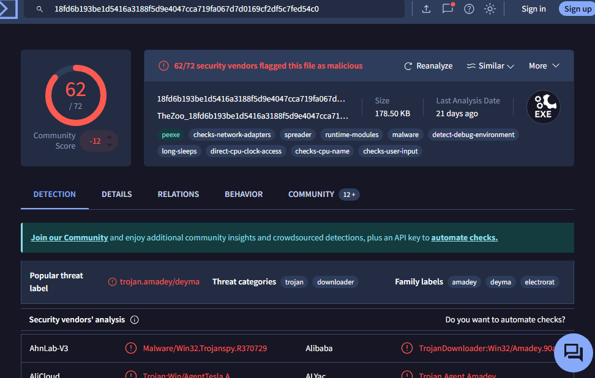
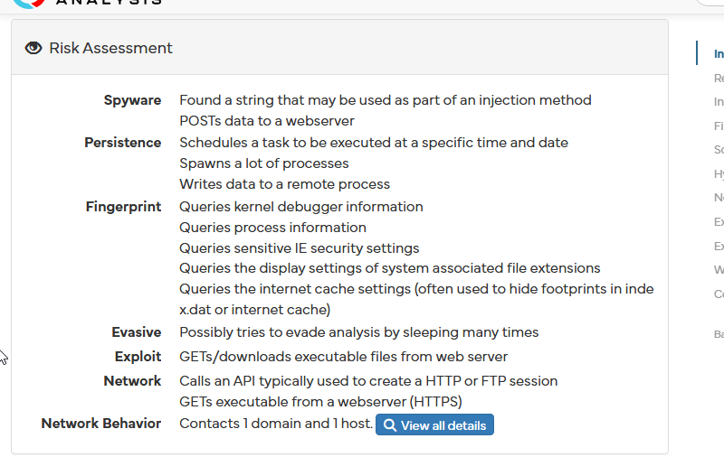

# Setting Up and Configuring Your Very Own Malware Sandbox 
In this documentation i'm going to be covering setting up and using a malware-analysis sandbox, which is basically like a mini isolated computer you can run malware on without worrying about leaking or corrupting your files.

Things you will need:
- A virtual machine with a fresh windows ISO installed on it (I have a separate guide on how to set up a virtual machine)
- Around 6-8 allocated time where you don't need to use your computer

Flare VM is basically kinda like the Swiss Knife of digital forensics and analysts it has all the major tools you need to do a successful analyse on a file both static and dynamic. I'm gonna be letting you know the things I did as well as things you can learn from me.

## Installing FlareVM
1. Open Powershell as administrator on your virtual machine
2. Download a new installer script, this will be held to your desktop files
```
(New-Object net.webclient).DownloadFile('https://raw.githubusercontent.com/mandiant/flare-vm/main/install.ps1',"$([Environment]::GetFolderPath("Desktop"))\install.ps1")
```
3. Navigate to the 'Desktop' Directory of your vm you can do usually by typing "cd desktop" or "cd onedrive/desktop" depending if you keep your files in one drive, type "dir" to see all files inyour current directory until you find the "installer.ps1" file
4. You need to disable windows defender firewall, automatic updates as well as antiviruses to do the next step
[heres link for disabling windows firewall guide](https://learn.microsoft.com/en-us/answers/questions/2152443/how-to-disable-the-windows-defender-firewall-on-wi). 
- For the antivirus you can go to Windows Security > Viruses & Threat Proection > Manage Settings and Toggle Real Time Protection Off.
- For the automatic updates go to Settings > Update and Security > Windows Update > Pause Updates and pause for the longest time possible
- You can turn these back on after installation but be careful when you're deliberately trying to run malware as it can block it before you even get the chance to run it.

5.Now you need to unblock the file and run since it runs some low level access changes do this by typing
```
Unblock-File .\install.ps1
Set-ExecutionPolicy Unrestricted -Force

//if you recieve an error type
Set-ExecutionPolicy Unrestricted -Scope CurrentUser -Force

//then to install use
.\install.ps1
```
6. For me i used ".\install.ps1 -password <password> -noWait -noGui" because my GUI would clip through my virtual machine and make it impossible to press any buttons so I chose to entire skip the GUI step but keep it on because you can customise how much tools you want in the VM.
7. Now we wait, I was not told this earlier but installing FlareVM took me a VERY long time, I left it on overnight but it froze so I had to go back and press enter on the terminal every so often (i'm not sure it does anything but it worked for me). You should expect to wait around 1 hour fastest and 10 hours slowest (without freezing), any later than that and i recommend increasing the number of processors, and RAM in your vm.
8. Now we need to do some configurations to make your machine is as 'hardened as possible' so if worse case a virus does try to escape the vm into your host computer you have protections
- Set your network adapter to a custom VNet network set to host-only (tutorial on how to make your own also in that guide i mentioned earlier)
- Delete USB adapters (I did this just to restrict my attack surface it's optional)
- Set your Vm to powered off or suspended, go to Settings > Options > Guest Isolation > Disable 'Drag and Drop' and 'Copy and Paste' this is to prevent viruses escaping through clipboards
- If not already also in Options > Shared Folders select disabled.
- If in doubt treat your machine as if it's already infected, do not enter any personal information inside. If you need to use internet access switch to NAT (NEVER BRIDGED) it doesn't have the same level of abstraction and can spread to your other devices on your network. You can also temporarily enable drag and drop for file transfers for malware samples but disable it back afterwards. When your VM background is pink its connected when its black its disconnected.
- Detach your ISO file you can do this by going Settings > CD/DVD (SATA) and select 'Use physical device. Then VM > Renovable Devices > Disconnect
- Update your VM if there is any new updates
9. Now set a new 'clean' snapshot for your machine to revert back to after every analysis. This is good practice. Do this through VM > Snapshot > Take Snapshot

Now you're done and you have an sandbox to play around with :)


## Using your VM
Now you have your VM set up let's get to actually using your VM, I have some malware I downloaded from 
[this link](https://github.com/ytisf/thezoo) for analysis. PLEASE be careful handling these as these are legitimate and will mess up your machine so I do not suggest double clicking on an executable file (luckily all of them are zipped so it prevents this) because it runs it. BE VERY CAFEFUL HANDLING UNZIPPED MALWARE. For now we will focus on static analysis and move on to dynamic analysis later

That being said unzip your Zoo filezip (which i assume you've downloaded already from Github, go to Code > Download Zip) pick a random one to analyse, I picked malware > Binaries > All.ElectroRAT cause it was the first one there.

What you'll notice inside the file is an MD5 hash, a SHA hash and a PASS file for the password to unzip the malware folder, it's usually 'infected'. Please unzip the malware foldr. 

### Using Hashes to Check with Databases
Immediately you can get the hash of the file (i used '2a3b92...') by Right-Clicking any of the malware files and clicking "HashMyFiles" this would give you MD5 and SHA256 hashes (different methods).I know the hashes are already given but for this exercise let's pretend its not. These are used as basically a unique identifier for the malware, but note that if even a single line in the malware is changed the whole hash changes so usually attackers use this to reuse malware since a lot of them are already analysed and have their hash valued stored in a virus identifier database. 

1. Copy the hash, it can be either MD5 and SHA 256. 
2. Paste into [Virus Total](https://www.virustotal.com/gui/home/upload) or [Hybrid Analysis](https://hybrid-analysis.com/) (for hybrid analysis you can drag in the whole file). I suggest using both to cross reference since some malware can go undetected in either.
3. Get your results, congrats you just did you first look up!



Virus Total as well as Hybrid Analysis both marks it as a Trojan, a sort of virus that attaches itself to a legitimate looking software. I like hybrid analysis more because it gives a more detailed overview.



So we can see from this that the 

1. Attacker can post data back remotely
2. Collect low level information about an infected device
3. Gets some sort of executable from the web using https

Since this folder came with multiple files I also ran it through malware analysis.

## Manual Analysis
Now that we got a general idea of what it does lets go in and take a look of the code to check if its a PE (portable executable), whether it's packed, version details, import details. We want to find both the architecture and the behavior of the code.

### File Structure Analysis
1. Right-Click on file "2a3b92.." with HxD (Hex Editor). On the top you will notice "4D 5A" which translates to "MZ" this just marks the file as a DOS (Disk Operating System) executable. You will notice when you scroll down on the right it would sometimes say “This program cannot be run in DOS mode” this is just the fallback in case the users trying to use a legacy system with DOS in. Despite being contradictory the file is a DOS file so the os recognises it but the content itself cannot be run in DOS. An accurate analogy would be like giving a chapter book to the toddler and sticking a note inside that says 'this is not for toddlers'. It can recognise the book and the picture in front of it but the actual content inside is unreadable.

2. You will also see a "50 45" or a 'PE' header, this marks that it is a PE file (most viruses are) and that all the content below would provide information on the file structure. This can include (but not limited to):
- Image Optional Header: Stores important information such as subsystems (GUIs, droppers, downloaders) and entry points
Note: Droppers are program designed to be basically like a gateway for your malware. It's made to avoid static analysis and calls the actual malware contents after. 
- Sections Table: Contains how and where to load executable sections into memory, it basically acts as the map for your content. Contains the name size and location.

3. Then you get to your actual content 'sections', this is where the actual malware code sits but most of it is highly encrypted so it will look like a bunch of gibberish. To find you section headers (sub sections), drag and drop your file into PEStudio (a program inside FlareVm) and go down to sections. 
- You will see a .text section, this most likely is where the code is being kept but every attacker is different sometimes they store their code in resources sometimes they store remotely so we cannot be for sure. I'm guesing though since it has a ratio of 74% theres a good chance this is where the malware starts.
- .rdata is data that can only be read this most likely holds a template or configurations that the program needs to refer back to
- .data is like .rdata but you can both read and write so sort of like a whiteboard to store and change information. It holds global variables and state changes.
- .rsrc is a resource file they would include strings, icons, dialogs, version info, embbedded files and any media the program would need to run
- .reloc is a file which contains addresses for relocation in case the porgram cannot load at its preferred base address

Note that these headers does not mean the file is a virus, all executable headers have this to recognise a virus from a non virus we need to do a wide variety of different things.

### Import Analysis
A good way to get an idea of the behaviour of a program is to look at its imports. Based on PEStudio it made 105 imports from Kernel32.dll, and 7 from Wininet (which allows for internet connectivity). 

One red flag shown is that it does show signs of process injection via hollowing from the combination of "Suspend/Resume Thread" + "GetCurrentThreadId" + "VirtualAlloc" + "Write Process Memory" + "NtUnmapViewOfSection" but I'm not at the stage where I can say for sure.

It also does confirm it tries to gain internet access through  "InternetConnectW" + "InternetOpenW" + "InternetReadFile" + "Internet Open URL" which it allows it to run an executable with "ShellExecuteExW"

It also snoops through and changes file configurations through  "FindFirstFileExW" + "FindNextFileW" + "GetFileAttributesA".

### String Analysis
Moving onto file strings we want to extract all information we can read. We can either do this through the Command Line Interface (CLI) or Control Terminal with "strings -n 8 filename_location". Or right-on the file and click 'Strings' then change the min-size to 8, this would usually help filter out unreadable garbage strings.

Here are some things I found:
- Popular antivirus and cybersecurity company names, probably for detection
- A sleep import, probably hints to persistence
- http:// and https:// prefixes
- 5120 i'm guessing is the port number for tcp/udp
- A file path to a file "D:\Mktmp\Release\NL1.pdb
- XML code for privilege escalation
- part of a POST method for encoded data 

This is all I have so far, I will come back and continue to analyse tomorrow...