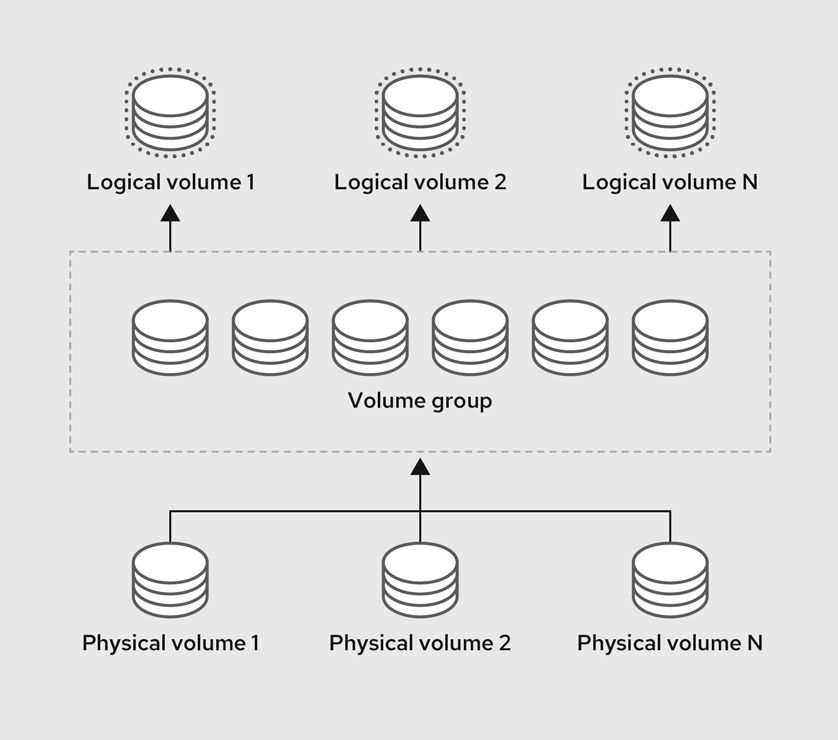
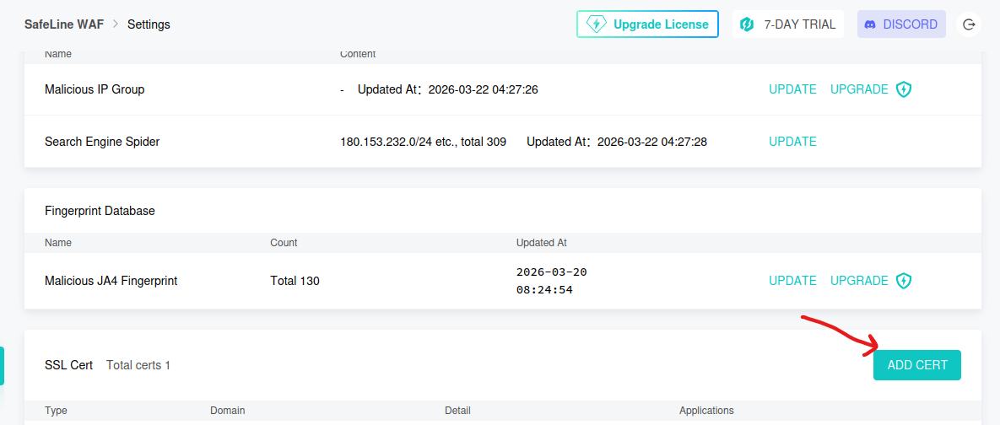
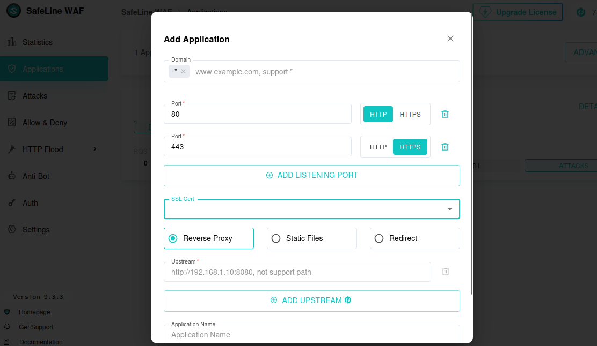

# Part 1 - Setting up a firewall
At this point I've already installed and set up two virtual machienes

1. A Kali Linux Machiene
2. An Ubuntu Server with GUI installed (cause i was not gonna look at a black and white terminal)

This was relatively easy it simply involves downloading VMWare, A Kali Linux Image and a Ubuntu Image and uploading it and answering questions. Note that there is a few things I did while installing it
* Enabled Logical Volume (LV) for dynamic disk partitioning
* Enabled my machienes to be bridged to my physical network (you can do this via Edit Virtual Machienes Settings > Network Adapter > Network Connection and select bridged)

## Manually Configuring DNS
Once I got my machines I go into terminal and type

```
hostname -I
```
This will give you the virtual machienes IP address (should be something like 192.168.x.x), assuming that DHCP configured properly during installation. A few other flags that might be useful would be
* -f : shows your device (fully qualified) domain name
* -s : shows your device hostname

Now once you got your own IP go into the other machines terminal and type

```
sudo nano /etc/hosts
```

There are a few commands you should know when using terminal:

* Sudo - (Superuser do) basically gives you access/edit permisions of the administrator since you basically can't really do much as a regular user unless you go in and configure it which wouldn't really be a smart practice to grant regular users admin access. You type it before every command, if you're too lazy to do it you can type "sudo su" and then your password which temporary grants you an admin session and you can type 'exit' to...yk exit it.
* Nano is kinda like the janky text editor of linux, you can't really click to places with your mouse so you have to use your arrow keys and type ctr+O to write to folder and ctr+X to exit
* Cat is another way to open folders by dumping all the file contents onto your terminal (which i feel is a bit uncomfortable so i usually just stick to nano but a lot of developers use it i'm not sure why)

Once you got the hosts file open you simply need to add the IP address and the fully qualified domain using name "hostname -f" and now in your browser you can refer to the other machines by its domain name instead of 192.168.x.x.

Now repeat the process with the other machine so both machines know each others IP

## Installing Dependencies
Now go into your Ubuntu machiene and install everything below. If the docker command doesn't install all you need then you gotta go in manually. There are many helpful more detailed links on stuff you need which I will list below but essentially the main things you need for this project is
* Docker
* Docker Compose
* Safeline

### As well as the LAMP Stack
* Linux - already installed at this point
* Apache - for hosting web services with dvwa
* My SQL - stores DVWA data
* PHP - runs dvwa configurations

And also the star of the show
* Damn Vulnerable Web Application (DVWA) - web application made intentionally to break into

### Installing Safeline/Docker/Docker Compose
**For Safeline (All in One)**
```
bash -c "$(curl -fsSLk https://waf.chaitin.com/release/latest/manager.sh)" -- --en
```

Note: During this it will give you an administrative user+password, write this down somewhere because you'll be needing it to log into the safeline browser controls

### Memory Error
During this time, when I tried to install Safeline I also got this error 'Remaining memory is less than 1 GB', even though I had just initialized my machiene and allocated at least 40 GB worth of memory. After some investigation the core root was that my logical volume group (lv) only had little memory left. To do a quick explaination the VM currently stores it's memory in the allocated RAM you give it, when the RAM is nearly becoming full it does this thing called 'swapping' where it writes the RAM memory to disk. Since I set up using logical volume it would be allocated to my logical volume on the disk through these steps:
1. My disk (40GB) gets separated into partitions
2. Partitions then gets converted into physical volume (pvs), which then can be combined in a volume group (vgs)
3. Volume groups then get dynamically allocated into Logical Volumes (lvs) to be memory for different functions in the VM, whether it's running the os, retaining backups, holds files..etc



To do this I must expand memory in this order Partition --> Physical Volume --> Logical Volume (Volume group gets dynamically allocated with physical volume so you don't need to manually do it)

```
#note for me my filesystem was in sda3, your's can be in either sda1 or sda2 so make sure to use this command to check which one was actually being used for safeline

lsblk

#usually theres 2 around 1.x G and 1M these are for booting the service and padding for alignment you dont need to worry about them

# expand partition
growpart /dev/sda 3 #remember to have the space between sda and your number

# update physical volume on new space
pvresize /dev/sda3

# expand logical volume from physical volume, lvs only refer to their vgs not their pvs. Also instead of "-l +100%FREE" you can use "-L +xG" where x is your number of GiBs, for more controlled expansion.

lvextend -l +100%FREE /dev/ubuntu-vg/ubuntu-lv 

# expand filesystem inside lvs
resize2fs /dev/ubuntu-vg/ubuntu-lv

```

And after that I could install safeline

### If your main link doesn't install everything
**For Docker:**

Here's the Installation Guide: [click here for guide](https://docs.docker.com/engine/install/)

**For Docker Compose**

Which is basically a docker manager for your containers since you will be running multiple
```
sudo apt install -y docker-compose-plugin
```

### Installing the LAMP Stack

**We're gonna be needing all this later on:**
```
sudo apt-get update && sudo apt-get install -y apache2 php php-mysql mysql-server

sudo systemctl start apache2 && sudo systemctl enable apache2
```
### For DWVA
Apache should have already given us a folder located inside **/var/www/html** that contains all the pages that our apache server shows when you search up the domain, you gotta deploy dvwa inside that server.
```
sudo apt-get install -y git
sudo git clone https://github.com/digininja/DVWA.git /var/www/html
sudo chown -R www-data:www-data DVWA && sudo chmod -R 755 DVWA
```
This installs git into your VM and clones the DWVA git into the folder that I mentioned earlier. 'chown' changes the owners/group of DVWA to www-data which is a system user created specifically for web servers, so they can access it. It also changes the access controls for users-group-others to 755 which in binary is 111, 101, 101 which each position corresponds to the read-write-execute of the group. For example users is 7 which is full read-write-execute permissions (111) and group/others have 5 which is read-NOTWRITE-execute permissions (101).

#### Take a look at DVWA's config
To let you know how this works config.inc.php is the main configuration file that tells the app how to connect to the database.

In order to set this up we need to run some commands

```
sudo cp /var/www/html/dvwa/config/config.inc.php.dist /var/www/html/dvwa/config/config.inc.php
```
This basically copies the distribution file into a file you can edit (NEVER EDIT THE DISTRIBUTION FILE), here you can see the web applications credentials for accessing the SQL server. I personally kept it the same though. It will contains things such as:

```
$_DVWA['db_user'] = 'dvwa_user';
$_DVWA['db_password'] = 'p@ssw0rd';
$_DVWA['db_database'] = 'dvwa';
$_DVWA['db_server'] = 'localhost';
```
Which lets the web application know the user, password, database_name and server of where the SQL is gonna be. For me I didn't find the need to change anything but it's entirely up to you.

#### Setting up DWVA Database 
In order to actually link queries to a database, you actually need a database that matches the stuff above so I ran the command lines below

```
sudo mysql -u root -p

CREATE DATABASE dvwa;

CREATE USER 'dvwa_user'@'localhost' IDENTIFIED BY 'p@ssw0rd';

GRANT ALL ON dvwa.* TO 'dvwa_user'@'localhost'; \

FLUSH PRIVILEGES; 
EXIT;
```
* The first line allows yuu to run the MYSQL shell which allows you to make SQL databases
*You're creating a new database called dvwa and which dvwa would store all its tables and data to
* And you also initialise a default user to access the database that can only be accessible by the host machine (the ubuntu one which has a password of 'p@ssw0rd)
* grants full priveleges on the dvwa database to the user
* reloads the priviledges table and exits

### For Apache
For my webserver itself I sorted out the configurations to be able to first have my domain point to the DVWA server then be able to run https.

#### Configuring the Apache Config Files

```
cd /etc/apache2
sudo nano apache2.conf
```
then scroll down and paste next to a block that looks similar:
```
<Directory /var/www/html/DVWA>
    Options Indexes FollowSymLinks
    AllowOverride All
    Require all granted
</Directory>
```

then go to allow the domain to point to the DVWA application directly do

```
sudo nano /etc/apache2/sites-available/000-default.conf
```

and then change DocumentRoot to "/var/www/html" as well as "Virtual Host" from 80 to 8080

#### Creating certificates
In order to run https instead of http you need a certificate. Usually we need a CA for this if were a large organisation but we can self sign it which is just using our own priv key to authenticate it.

To make a private key, you follow the following steps I made a folder to keep it on just to be neat but you don't have to do this


```
sudo mkdir /etc/ssl/dvwa
cd /etc/ssl/dvwa
openssl genrsa -out priv.key 4096
openssl req -new -new priv.key -out priv.csr
openssl x509 -req -days 36 -in priv.csr -signkey priv.key -out priv.crt
```

Basically to create a certificate you need a private key and a csr (certificate signing request). In the csr it's gonna ask a few things such as your name and organisation and yada yada but basically you need to feed this into the x.509 certificate which basically tells other users "yes I own this public key I signed it with my private key". Usually the process looks like this 

RSA Private Key --> CSR Request (generates Public Key at this time) --> CRT Certificate (validates public key)

### Setting Up Safeline Firewall
In your vm browser search up
```
https://<Insert_Your_Ip>:9443/
```

If you configured your domain name in the /etc/hosts file you can also use that in place of your IP

You want to first go into Settings > Add Certs, then paste the contents of your crt and key folder int here. If you don't know how to do this

```
cd /etc/ssl/dvwa
sudo cat priv.key
sudo cat priv.crt
```




and copy and paste, then you will need to go to applications to add the DVWA application to the firewall



Here you:
* Add the domain name
* Ideally you should delete the port 80 connection so it'll only now allow https requests
* Add the IP address for your DVWA link it should be like 192.168.x.x:8080 or something like that, refer to the top of this page if you don't know how to get your IP address
* Then select "Reverse Proxy" this will allow a proxy to recieve guests on the internal network for you and forward them appropriately to the DVWA server

Now your done with the basics, you simply just need to use the UI in the Safeline browser to configure certain things. For example I set up rate limiting and access limiting and also disabled sql injections so I could see if I could do that in my DVWA on my Kali Linux Machine and it worked. I was able to get access to "confidential-files" by doing an SQL injection on the input prompt 

